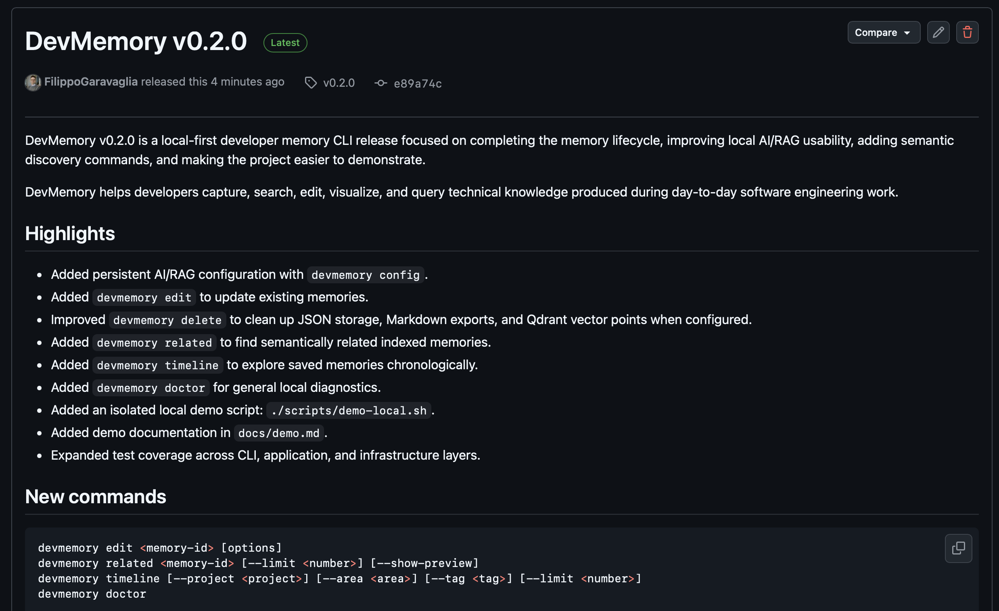
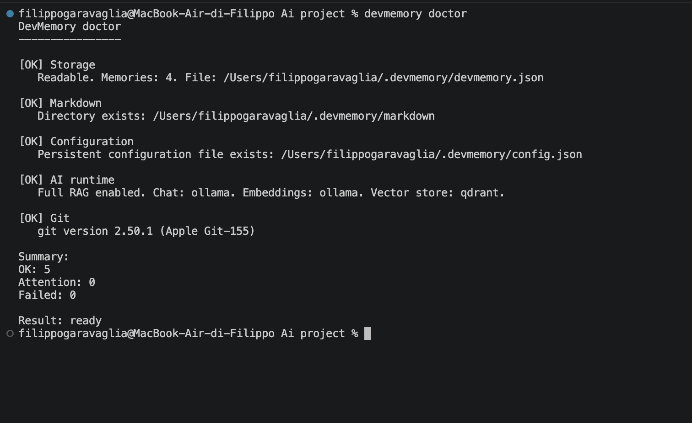
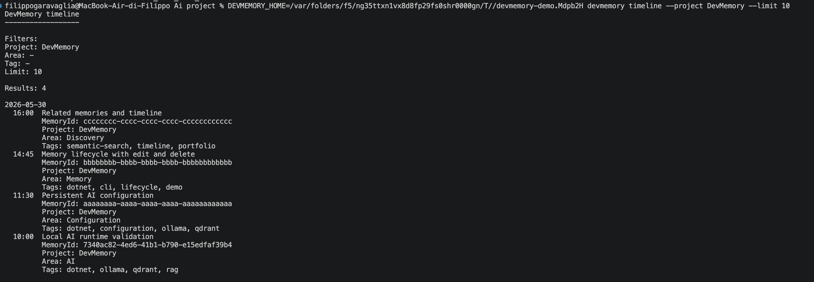
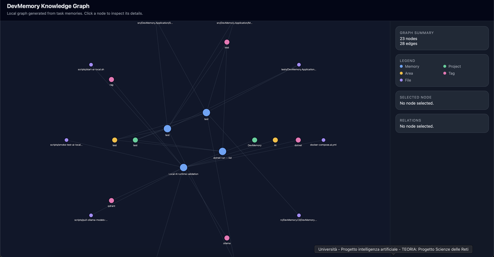
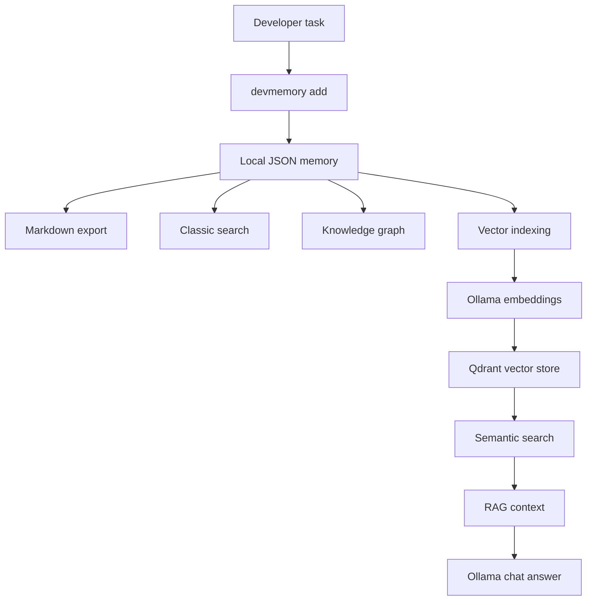
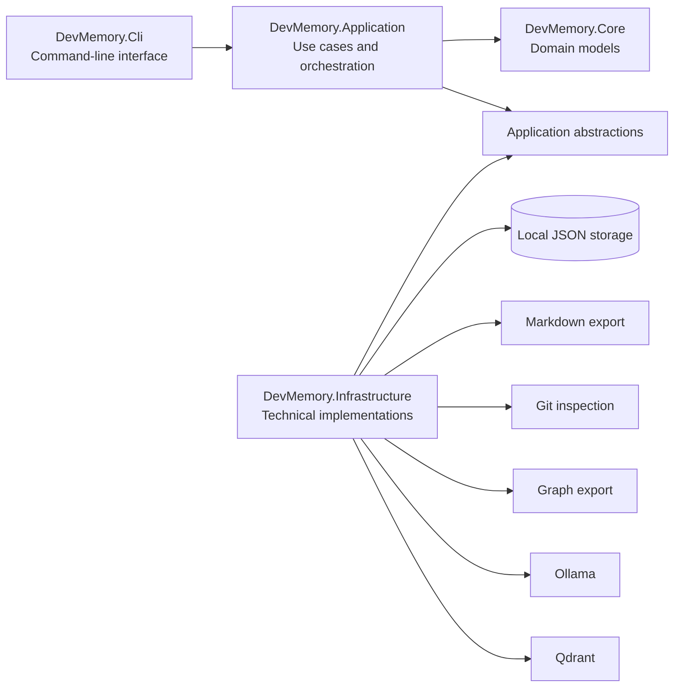
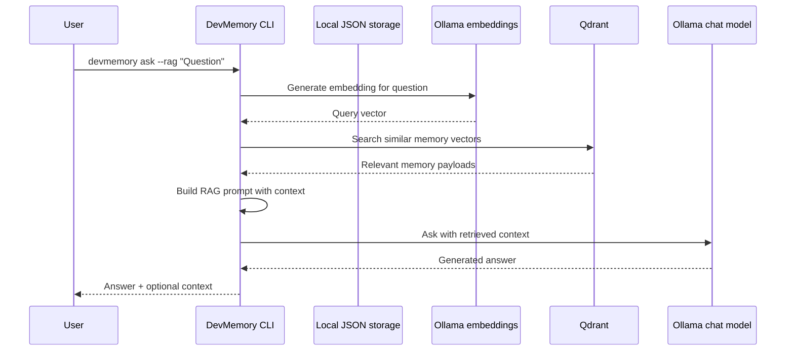
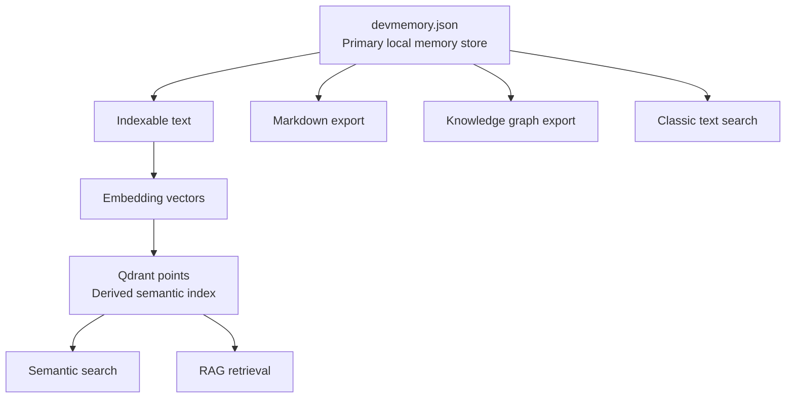
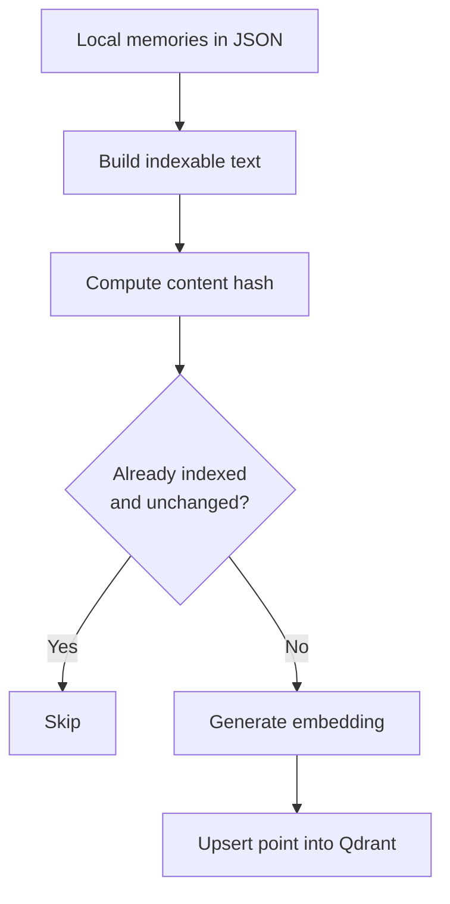

[](https://github.com/filippogaravaglia/DevMemory/actions/workflows/ci.yml)


<div align="center">

# DevMemory

### Local-first AI memory for developers

**DevMemory** is a local-first .NET CLI that helps developers capture technical context, index it semantically, and ask questions about past work using local AI.

It turns day-to-day engineering notes into a searchable developer memory powered by **.NET**, **Ollama**, **Qdrant**, semantic search and RAG.

</div>

---

## Table of contents

* [What is DevMemory?](#what-is-devmemory)
* [Preview](#preview)
* [Why DevMemory?](#why-devmemory)
* [Quick start](#quick-start)
* [Try the isolated local demo](#try-the-isolated-local-demo)
* [Core workflow](#core-workflow)
* [Architecture overview](#architecture-overview)
* [RAG flow](#rag-flow)
* [Demo output](#demo-output)
* [Key features](#key-features)
* [Local-first by default](#local-first-by-default)
* [Installation](#installation)
* [Basic usage](#basic-usage)
* [Memory lifecycle](#memory-lifecycle)
* [Git integration](#git-integration)
* [Markdown export](#markdown-export)
* [Knowledge graph](#knowledge-graph)
* [Local AI setup](#local-ai-setup)
* [AI configuration](#ai-configuration)
* [Vector indexing](#vector-indexing)
* [Semantic search](#semantic-search)
* [Related memories](#related-memories)
* [RAG questions](#rag-questions)
* [AI commands](#ai-commands)
* [Daily usage](#daily-usage)
* [Environment variables](#environment-variables)
* [Backup and restore](#backup-and-restore)
* [Local development scripts](#local-development-scripts)
* [Architecture](#architecture)
* [Quality and release engineering](#quality-and-release-engineering)
* [Testing](#testing)
* [CI](#ci)
* [Current release status](#current-release-status)
* [Current limitations](#current-limitations)
* [Roadmap](#roadmap)
* [Privacy](#privacy)
* [Project goal](#project-goal)
* [License](#license)

---

## What is DevMemory?

DevMemory is a **local-first developer memory CLI**.

It helps you save structured memories about the work you do every day:

* what problem you solved;
* what solution you implemented;
* what decisions you made;
* which files you touched;
* which tests you ran;
* what you learned;
* which project, area, branch and tags the task belongs to.

Those memories are stored locally, can be searched with classic text search, exported to Markdown, visualized as a knowledge graph, indexed into a vector database, and queried through a local RAG pipeline powered by Ollama and Qdrant.

The goal is simple:

> Stop losing technical context between tasks, branches, commits, code reviews and AI chat sessions.

---

## Preview

### DevMemory v0.2.0 release

DevMemory v0.2.0 introduces a complete memory lifecycle, persistent AI/RAG configuration, related memories, timeline, diagnostics, and an isolated local demo.



### General diagnostics

`devmemory doctor` checks the local DevMemory environment, including storage, Markdown export, persistent configuration, AI runtime status, and Git availability.



### Project timeline

`devmemory timeline` shows saved memories chronologically, making it easier to understand how a project evolved over time.



### Knowledge graph

`devmemory graph-view` generates a local HTML graph view from saved memories, projects, areas, tags, files, and relationships.



---

## Why DevMemory?

As developers, we often solve problems and then lose the context a few days later.

Common questions:

* What did I change last time in this area?
* Why did I make that technical decision?
* Which files were involved in that refactor?
* How did I solve a similar MongoDB mapping issue?
* What tests did I run for that bug fix?
* What did I learn from that task?
* Can I ask an AI assistant using my previous technical work as context?

DevMemory is built to answer those questions from your own local engineering memory.

It is not a generic chatbot.
It is a **personal technical memory layer** for software engineering work.

---

## Quick start

### Install locally as a .NET global tool

From the repository root:

```bash
./scripts/install-local-tool.sh
```

Verify the installed command:

```bash
devmemory --version
devmemory help
```

Run the first-run setup guide:

```bash
devmemory setup
```

For local AI/RAG setup instructions:

```bash
devmemory setup --local-ai
```

### Save your first memory

```bash
devmemory add
```

Then inspect what you saved:

```bash
devmemory list
devmemory search "runtime"
devmemory show <memory-id>
```

### Enable local AI/RAG

Start local AI dependencies:

```bash
./scripts/dev-ai-local.sh pull-models
./scripts/dev-ai-local.sh start
./scripts/dev-ai-local.sh doctor
```

Set persistent local AI configuration:

```bash
devmemory config set chat-provider ollama
devmemory config set embedding-provider ollama
devmemory config set vector-store qdrant
devmemory config set ollama-chat-model llama3.2
devmemory config set ollama-embedding-model nomic-embed-text
devmemory config set qdrant-collection devmemory_memories
```

Index your memories:

```bash
devmemory index
```

Ask a RAG question:

```bash
devmemory ask --rag --show-context "What did I decide about Qdrant?"
```

You can also override configuration temporarily through environment variables:

```bash
DEVMEMORY_CHAT_PROVIDER=ollama \
DEVMEMORY_EMBEDDING_PROVIDER=ollama \
DEVMEMORY_VECTOR_STORE=qdrant \
devmemory ask --rag --show-context "What did I decide about Qdrant?"
```

---

## Try the isolated local demo

DevMemory includes an isolated demo script that lets you try the main CLI features without touching your real `~/.devmemory` data.

From the repository root:

```bash
./scripts/demo-local.sh
```

The demo creates a temporary `DEVMEMORY_HOME`, seeds sample memories, and runs commands such as:

```bash
devmemory doctor
devmemory list
devmemory search "qdrant"
devmemory show <memory-id>
devmemory timeline --project DevMemory
devmemory edit <memory-id> --add-tag demo
devmemory graph-export
devmemory graph-view
```

If Ollama and Qdrant are running, the script also demonstrates semantic search, related memories, and RAG.

To keep the generated demo data for inspection:

```bash
DEVMEMORY_KEEP_DEMO_HOME=true ./scripts/demo-local.sh
```

See [docs/demo.md](docs/demo.md) for the full demo guide.

---

## Core workflow

A typical DevMemory workflow looks like this:

```bash
devmemory setup
devmemory add
devmemory list
devmemory search "revision"
devmemory timeline --project DevMemory
devmemory index
devmemory semantic-search "estimate revision cloning"
devmemory related <memory-id>
devmemory ask --rag "How did we validate the local AI runtime?"
```

At a high level:



---

## Architecture overview

DevMemory follows a layered .NET architecture and keeps the CLI as a thin composition layer.



The local JSON file is the **source of truth**.
Qdrant is a **derived semantic index** that can be rebuilt.

---

## RAG flow

When you ask a RAG question, DevMemory does not simply send your whole storage file to the model.

It retrieves the most relevant memories first.



This means DevMemory can answer using multiple related task memories when needed.

---

## Demo output

Example RAG output from a validated local run:

```text
DevMemory RAG answer
--------------------

Provider: ollama
Model: llama3.2
Question: How did we validate the local AI runtime in DevMemory?
Context items: 2

Answer:
We validated the local AI runtime in DevMemory by following a multi-step process:

1. Setup: We installed and started Ollama for local chat and embeddings,
   downloaded llama3.2 and nomic-embed-text, and started Qdrant through Docker.
2. Indexing: We indexed a local DevMemory task using the devmemory index command.
3. Semantic Search: We executed semantic search on the indexed task.
4. RAG Question: We asked a RAG question using the retrieved context.

Context:

1. Local AI runtime validation
   Project: DevMemory
   Area: AI
   Score: 0.7493111
```

This validates the complete local flow:

```text
JSON memory
→ indexable document
→ Ollama embedding
→ Qdrant upsert
→ semantic retrieval
→ RAG context
→ Ollama chat completion
→ answer shown in CLI
```

---

## Key features

* Local-first structured developer memories.
* JSON-based local storage as the source of truth.
* First-run setup guidance with `devmemory setup`.
* Markdown export for every memory.
* Add, list, show, search, edit and delete memory lifecycle.
* Ranked text search with project, area and tag filters.
* Git repository inspection.
* Memory draft creation from Git context.
* Knowledge graph JSON export.
* Local HTML knowledge graph view.
* Timeline view for chronological project exploration.
* Persistent AI/RAG configuration.
* Vector indexing with embeddings.
* Semantic search through Qdrant.
* Related memories through semantic similarity.
* Local RAG answers through Ollama.
* General diagnostics with `devmemory doctor`.
* AI runtime diagnostics with `devmemory ai-doctor`.
* Isolated local demo script.
* Backup and restore scripts.
* Release-ready package validation.
* Installable as a .NET global tool.
* CI, formatting checks, tests, release checks and package artifact verification.

---

## Local-first by default

DevMemory stores your primary data locally.

Default storage path:

```text
~/.devmemory/devmemory.json
```

Markdown exports:

```text
~/.devmemory/markdown/
```

Knowledge graph exports:

```text
~/.devmemory/graph/
```

You can customize the storage directory with:

```bash
DEVMEMORY_HOME=~/devmemory-work devmemory storage
```

The local JSON storage is the source of truth.
The vector database is a derived index and can be rebuilt.

### Data ownership model



If Qdrant is lost, memories are not lost.
You can rebuild the vector index from the JSON storage.

---

## Installation

### Prerequisites

* .NET SDK 10
* Git
* macOS, Linux or Windows terminal environment
* Docker Desktop, only for local Qdrant/vector search
* Ollama, only for local AI/RAG

---

### Package the CLI

From the repository root:

```bash
dotnet pack src/DevMemory.Cli/DevMemory.Cli.csproj -c Release -o artifacts/packages
```

---

### Install as a .NET global tool

```bash
dotnet tool install --global DevMemory.Cli --add-source ./artifacts/packages
```

If already installed:

```bash
dotnet tool update --global DevMemory.Cli --add-source ./artifacts/packages
```

Make sure .NET global tools are available in your `PATH`:

```bash
export PATH="$PATH:$HOME/.dotnet/tools"
```

Then verify:

```bash
devmemory --version
devmemory help
```

---

## Recommended local installation

For local development, use the provided script:

```bash
./scripts/install-local-tool.sh
```

This script:

* builds the solution;
* runs the test suite;
* packages the CLI;
* uninstalls any previous local global-tool installation;
* installs the new package globally;
* verifies the installed command.

After this step, you can use:

```bash
devmemory
```

from anywhere.

---

## Basic usage

### Add a memory

```bash
devmemory add
```

A memory contains:

```text
Title
Project
Area
Branch
Tags
Problem
Solution
Decisions
Files touched
Tests
Lessons learned
```

Good memories produce better search and RAG answers.

A good memory should describe:

* the real problem;
* the implemented solution;
* the relevant decisions;
* the important files;
* the tests or validations performed;
* the lesson learned.

---

### List memories

```bash
devmemory list
```

---

### Search memories

Classic text search:

```bash
devmemory search "revision"
```

With filters:

```bash
devmemory search "revision" --project LogicalCommon
devmemory search "revision" --area Estimate
devmemory search "revision" --tag mongodb
```

Classic search reads directly from the local JSON storage and does not require Ollama or Qdrant.

---

### Show a memory

```bash
devmemory show <memory-id>
```

---

### Show storage path

```bash
devmemory storage
```

---

### Show Markdown export directory

```bash
devmemory markdown
```

---

### Show first-run setup guidance

```bash
devmemory setup
```

Available setup modes:

```bash
devmemory setup --local-ai
devmemory setup --demo
devmemory setup --check
```

The setup command does not modify local data. It prints safe onboarding instructions for local usage, local AI/RAG configuration, isolated demo execution and setup validation.

---

## Memory lifecycle

DevMemory supports a complete local memory lifecycle.

### Edit a memory

```bash
devmemory edit <memory-id> --title "Updated title"
devmemory edit <memory-id> --solution "Updated implementation notes"
devmemory edit <memory-id> --add-tag rag
devmemory edit <memory-id> --remove-tag test
devmemory edit <memory-id> --add-file src/Example.cs
devmemory edit <memory-id> --add-test ExampleTests
```

When a memory is edited, DevMemory updates the primary JSON storage and regenerates the derived Markdown export.

If the memory was previously indexed into the vector store, rebuild the index to keep semantic search aligned.

### Delete a memory

```bash
devmemory delete <memory-id>
devmemory delete <memory-id> --yes
```

Delete removes the memory from local JSON storage and cleans up derived artifacts when possible:

```text
JSON memory
Markdown export
Qdrant vector point, when vector store cleanup is configured
```

JSON remains the source of truth. Markdown and Qdrant are treated as derived artifacts.

### Timeline

```bash
devmemory timeline
devmemory timeline --project DevMemory
devmemory timeline --area AI
devmemory timeline --tag rag
devmemory timeline --limit 10
```

The timeline shows saved memories chronologically and helps understand how a project evolved over time.

### General diagnostics

```bash
devmemory doctor
```

`devmemory doctor` checks the local DevMemory environment:

```text
storage readability
Markdown directory
persistent configuration
AI/RAG runtime configuration
Git availability
memory count
```

---

## Git integration

### Inspect current repository

```bash
devmemory git-status
```

Inspect another repository:

```bash
devmemory git-status --path ~/work/my-repository
```

DevMemory reads:

* repository path;
* current branch;
* last commit hash;
* last commit message;
* changed files.

Generated files are filtered automatically.

---

### Create a memory draft from Git context

```bash
devmemory learn-from-git
```

This creates a memory draft using current Git information, including project, branch and files touched.

You then complete the meaningful engineering context manually:

* problem;
* solution;
* decisions;
* tests;
* lessons learned.

---

## Markdown export

Every saved memory is exported to Markdown.

Default directory:

```text
~/.devmemory/markdown/
```

Markdown exports include:

* metadata;
* problem;
* solution;
* decisions;
* files touched;
* tests;
* lessons learned;
* continuation prompt.

This makes memories easy to reuse in documentation, ChatGPT, GitHub Copilot, Claude, local LLMs or future AI-assisted workflows.

---

## Knowledge graph

### Export graph JSON

```bash
devmemory graph-export
```

Default output:

```text
~/.devmemory/graph/devmemory-graph.json
```

The graph includes relationships such as:

```text
Memory → Project
Memory → Area
Memory → Tag
Memory → File
```

---

### Generate local HTML graph view

```bash
devmemory graph-view
```

Default output:

```text
~/.devmemory/graph/devmemory-graph.html
```

Open it in the browser:

```bash
open ~/.devmemory/graph/devmemory-graph.html
```

The graph currently visualizes:

* memory nodes;
* project nodes;
* area nodes;
* tag nodes;
* file nodes.

---

## Local AI setup

DevMemory can work without AI for basic memory capture and classic search.

For semantic search and RAG, you need:

* Ollama running locally;
* Docker Desktop running;
* Qdrant started through Docker.

---

### 1. Install Docker Desktop

Docker is used to run Qdrant locally.

Verify Docker:

```bash
docker --version
docker compose version
```

---

### 2. Install Ollama

Ollama is used for local chat and embeddings.

Verify Ollama:

```bash
ollama --version
curl http://localhost:11434/api/tags
```

---

### 3. Pull local models

```bash
./scripts/dev-ai-local.sh pull-models
```

This pulls:

```text
llama3.2
nomic-embed-text
```

Verify:

```bash
ollama list
```

---

### 4. Start local AI services

```bash
./scripts/dev-ai-local.sh start
```

This starts Qdrant through Docker.

Verify Qdrant:

```bash
curl http://localhost:6333/collections
```

---

### 5. Diagnose local AI runtime

```bash
./scripts/dev-ai-local.sh doctor
```

Expected result when everything is ready:

```text
Result: AI environment looks ready.
```

---

### 6. Print local AI setup guidance

```bash
devmemory setup --local-ai
```

This prints the recommended local Ollama/Qdrant configuration commands and does not modify local data.

---

## AI configuration

DevMemory supports persistent local AI/RAG configuration.

Show current configuration:

```bash
devmemory config show
```

Set local AI defaults:

```bash
devmemory config set chat-provider ollama
devmemory config set embedding-provider ollama
devmemory config set vector-store qdrant
devmemory config set ollama-chat-model llama3.2
devmemory config set ollama-embedding-model nomic-embed-text
devmemory config set qdrant-collection devmemory_memories
```

Reset configuration:

```bash
devmemory config reset
```

Configuration precedence:

```text
Environment variables > ~/.devmemory/config.json > default values
```

This means you can either use persistent configuration for daily work or override values temporarily with environment variables.

---

## Vector indexing

Indexing turns local memories into vector-searchable documents.



---

### Dry-run indexing

Preview what will be indexed without generating embeddings or writing to Qdrant:

```bash
devmemory index --dry-run
```

Show indexable text:

```bash
devmemory index --dry-run --show-text --limit 1
```

---

### Real indexing

```bash
devmemory index
```

Useful options:

```bash
devmemory index --limit 3
devmemory index --force
devmemory index --project DevMemory
devmemory index --area AI
devmemory index --tag qdrant
```

Normal indexing skips memories that are already indexed and unchanged.
Use `--force` when you want to rebuild the index.

If persistent AI configuration is not set, you can use environment variables:

```bash
DEVMEMORY_CHAT_PROVIDER=ollama \
DEVMEMORY_EMBEDDING_PROVIDER=ollama \
DEVMEMORY_VECTOR_STORE=qdrant \
devmemory index
```

---

## Semantic search

Semantic search uses embeddings and Qdrant.

```bash
devmemory semantic-search "local AI runtime validation" --limit 3
```

Unlike classic text search, semantic search can retrieve memories based on conceptual similarity.

Example:

```text
Query: local AI runtime validation
Results: 1

1. Local AI runtime validation
   Project: DevMemory
   Area: AI
   Score: 0.7493111
```

If persistent AI configuration is not set, you can use environment variables:

```bash
DEVMEMORY_CHAT_PROVIDER=ollama \
DEVMEMORY_EMBEDDING_PROVIDER=ollama \
DEVMEMORY_VECTOR_STORE=qdrant \
devmemory semantic-search "local AI runtime validation" --limit 3
```

---

## Related memories

Related memories use semantic search to find memories connected to a specific memory.

```bash
devmemory related <memory-id>
devmemory related <memory-id> --limit 3
devmemory related <memory-id> --show-preview
```

This is useful when you want to rediscover previous work connected to the same topic, project, architectural decision or technical problem.

Related memories require:

```text
Ollama embeddings
Qdrant vector store
previously indexed memories
```

---

## RAG questions

Ask a question using retrieved memories as context:

```bash
devmemory ask --rag "How did we validate the local AI runtime in DevMemory?" --limit 3
```

Show the retrieved context:

```bash
devmemory ask --rag --show-context "How did we validate the local AI runtime in DevMemory?" --limit 3
```

Use `--show-context` when you want to understand which memories were used by the model.

If persistent AI configuration is not set, you can use environment variables:

```bash
DEVMEMORY_CHAT_PROVIDER=ollama \
DEVMEMORY_EMBEDDING_PROVIDER=ollama \
DEVMEMORY_VECTOR_STORE=qdrant \
devmemory ask --rag --show-context "How did we validate the local AI runtime in DevMemory?" --limit 3
```

---

## AI commands

### Show AI status

```bash
devmemory ai-status
```

### Diagnose local AI runtime

```bash
devmemory ai-doctor
```

or through the helper script:

```bash
./scripts/dev-ai-local.sh doctor
```

### Ask without RAG

```bash
DEVMEMORY_CHAT_PROVIDER=ollama devmemory ask "Reply with only: hello"
```

### Ask with RAG

```bash
devmemory ask --rag "What did I decide about Qdrant?"
```

---

## Daily usage

### Use DevMemory without AI

You do not need Docker or Ollama for:

```bash
devmemory setup
devmemory add
devmemory list
devmemory search "..."
devmemory show <memory-id>
devmemory edit <memory-id> [options]
devmemory delete <memory-id> [--yes]
devmemory timeline
devmemory doctor
devmemory git-status
devmemory learn-from-git
devmemory graph-export
devmemory graph-view
```

These commands use local JSON storage and local file exports.

---

### Use DevMemory with local AI/RAG

When you want semantic search, related memories or RAG:

```bash
# 1. Make sure Docker Desktop is running
# 2. Make sure Ollama is running

./scripts/dev-ai-local.sh start
./scripts/dev-ai-local.sh doctor
```

Then configure local AI once:

```bash
devmemory config set chat-provider ollama
devmemory config set embedding-provider ollama
devmemory config set vector-store qdrant
```

Index memories:

```bash
devmemory index
```

And query:

```bash
devmemory semantic-search "estimate revision"
devmemory related <memory-id>
devmemory ask --rag "What did I change in the estimate workflow?"
```

When finished:

```bash
./scripts/dev-ai-local.sh stop
```

---

## Environment variables

| Variable                           | Purpose                                                          |
| ---------------------------------- | ---------------------------------------------------------------- |
| `DEVMEMORY_HOME`                   | Custom DevMemory storage directory                               |
| `DEVMEMORY_CHAT_PROVIDER`          | Chat provider: `none`, `ollama`, `openai`, `gemini`, `anthropic` |
| `DEVMEMORY_EMBEDDING_PROVIDER`     | Embedding provider: `none`, `ollama`, `openai`, `gemini`         |
| `DEVMEMORY_VECTOR_STORE`           | Vector store: `none`, `qdrant`                                   |
| `DEVMEMORY_OLLAMA_ENDPOINT`        | Ollama endpoint                                                  |
| `DEVMEMORY_OLLAMA_CHAT_MODEL`      | Ollama chat model                                                |
| `DEVMEMORY_OLLAMA_EMBEDDING_MODEL` | Ollama embedding model                                           |
| `DEVMEMORY_QDRANT_ENDPOINT`        | Qdrant endpoint                                                  |
| `DEVMEMORY_QDRANT_COLLECTION`      | Qdrant collection name                                           |

Default local AI values:

```text
Ollama endpoint:          http://localhost:11434
Ollama chat model:        llama3.2
Ollama embedding model:   nomic-embed-text
Qdrant endpoint:          http://localhost:6333
Qdrant collection:        devmemory_memories
```

---

## Backup and restore

DevMemory is local-first, so backing up the local storage is important.

### Backup local data

```bash
./scripts/backup-devmemory-data.sh
```

This creates a timestamped backup and SHA-256 checksum.

You can customize the backup directory:

```bash
DEVMEMORY_BACKUP_DIR=~/Backups/devmemory ./scripts/backup-devmemory-data.sh
```

---

### Restore local data

Dry-run restore:

```bash
./scripts/restore-devmemory-data.sh ~/.devmemory/backups/<backup-file>.json --dry-run
```

Real restore:

```bash
./scripts/restore-devmemory-data.sh ~/.devmemory/backups/<backup-file>.json
```

The restore script:

* validates the backup file;
* validates checksum when available;
* creates a pre-restore backup of the current storage;
* requires explicit confirmation unless `--yes` is used.

---

## Local development scripts

### Build and test

```bash
./scripts/build-test.sh
```

This script:

* validates shell scripts;
* verifies formatting;
* builds the solution;
* runs the full test suite.

---

### Release check

```bash
./scripts/release-check.sh
```

The release check validates:

1. build and tests;
2. repository hygiene;
3. changelog entry;
4. version consistency;
5. package artifact structure;
6. CLI package smoke test;
7. final package checksum.

---

### Package release artifacts

```bash
./scripts/pack-release.sh
```

This runs the release check and prints the final package summary.

Generated artifacts:

```text
artifacts/packages/DevMemory.Cli.<version>.nupkg
artifacts/packages/DevMemory.Cli.<version>.nupkg.sha256
```

---

### Verify installed tool

```bash
./scripts/verify-installed-tool.sh
```

This verifies that the globally installed `devmemory` command works correctly.

---

### Local AI helper

```bash
./scripts/dev-ai-local.sh help
```

Available commands:

```text
setup
start
stop
doctor
pull-models
smoke
help
```

---

### Local AI smoke test

```bash
DEVMEMORY_AI_SMOKE_HOME="$HOME/.devmemory" ./scripts/dev-ai-local.sh smoke
```

This validates the local AI flow using the configured Ollama and Qdrant runtime.

---

### Isolated local demo

```bash
./scripts/demo-local.sh
```

This runs a complete local demo using a temporary `DEVMEMORY_HOME`.

It is safe to run because it does not modify your real `~/.devmemory` data.

---

### Clean generated files

```bash
./scripts/clean-generated.sh
```

This removes local generated files and build artifacts, but does not remove the real user storage under:

```text
~/.devmemory/
```

---

## Architecture

DevMemory follows a layered architecture.

```text
DevMemory.slnx
├── src
│   ├── DevMemory.Core
│   ├── DevMemory.Application
│   ├── DevMemory.Infrastructure
│   └── DevMemory.Cli
├── tests
│   ├── DevMemory.Application.Tests
│   ├── DevMemory.Infrastructure.Tests
│   └── DevMemory.Cli.Tests
├── scripts
└── docker-compose.ai.yml
```

---

### DevMemory.Core

Contains core domain models.

Example:

```text
TaskMemory
```

This layer does not depend on infrastructure, CLI, file system or Git implementation details.

---

### DevMemory.Application

Contains application behavior, abstractions and orchestration.

Examples:

```text
MemoryService
GitMemoryDraftService
MemoryGraphService
MemoryVectorIndexingService
MemorySemanticSearchService
MemoryRagAnswerService
VectorMemoryDocumentBuilder
MemoryFileFilter
```

Application abstractions include:

```text
IMemoryRepository
IMemoryExporter
IGitRepositoryInspector
IMemoryGraphExporter
IMemoryGraphHtmlExporter
IEmbeddingService
IChatCompletionService
IVectorMemoryStore
```

---

### DevMemory.Infrastructure

Contains technical implementations.

Examples:

```text
MemoryRepository
MarkdownMemoryExporter
GitRepositoryInspector
JsonMemoryGraphExporter
HtmlMemoryGraphExporter
OllamaChatCompletionService
OllamaEmbeddingService
QdrantVectorMemoryStore
AiRuntimeOptionsProvider
AiRuntimeConfigurationStore
```

This layer handles:

* JSON storage;
* Markdown export;
* Git command execution;
* graph JSON export;
* graph HTML export;
* Ollama integration;
* Qdrant integration;
* environment-based runtime configuration;
* persistent local AI/RAG configuration.

---

### DevMemory.Cli

Contains the command-line interface and composition root.

Main commands:

```text
add
list
search
show
edit
delete
timeline
setup
storage
markdown
git-status
learn-from-git
graph-export
graph-view
ai-status
ai-doctor
doctor
ask
index
semantic-search
related
config
version
help
```

The CLI entry point delegates command execution to dedicated command handlers.

---

## Quality and release engineering

DevMemory is developed as a production-oriented portfolio project.

Current quality practices include:

* layered architecture;
* clear separation between domain, application, infrastructure and CLI;
* unit tests for application, infrastructure and CLI behavior;
* formatting verification with `dotnet format`;
* repository-wide `.editorconfig`;
* repository line-ending normalization with `.gitattributes`;
* shared build configuration through `Directory.Build.props`;
* GitHub Actions CI;
* local release-check pipeline;
* NuGet package artifact verification;
* installed CLI smoke test;
* package checksum generation;
* repository hygiene verification;
* changelog verification;
* version consistency verification;
* backup and restore scripts;
* isolated local demo script;
* local AI diagnostics and smoke testing.

---

## Testing

Run all tests:

```bash
dotnet test DevMemory.slnx
```

Recommended full local validation:

```bash
./scripts/release-check.sh
```

The test suite covers:

* memory service behavior;
* validation and normalization;
* ranked text search;
* memory edit behavior;
* memory delete behavior;
* Markdown cleanup;
* JSON storage;
* Markdown export;
* Git memory draft creation;
* generated file filtering;
* graph generation;
* JSON graph export;
* HTML graph export;
* vector indexing;
* semantic search;
* related memories;
* RAG answer orchestration;
* persistent AI configuration;
* general doctor diagnostics;
* first-run setup command behavior;
* Ollama integration;
* Qdrant integration;
* Qdrant vector deletion;
* timeline output and filters;
* CLI command parsing and dispatching;
* CLI package behavior.

---

## CI

The GitHub Actions workflow runs the shared release-check pipeline.

It validates:

* formatting;
* build;
* tests;
* repository hygiene;
* changelog;
* version consistency;
* package structure;
* local package smoke test;
* checksum generation.

The workflow uploads:

```text
DevMemory.Cli.<version>.nupkg
DevMemory.Cli.<version>.nupkg.sha256
```

as build artifacts.

---

## Current release status

Latest published release:

```text
DevMemory v0.2.0
```

Current development branch:

```text
dev
```

DevMemory can currently be packaged and installed locally as a .NET global tool.

The package is not published to NuGet yet.

Release artifacts are attached to the latest GitHub Release and can also be generated locally under:

```text
artifacts/packages/
```

Published v0.2.0 artifacts:

```text
DevMemory.Cli.0.2.0.nupkg
DevMemory.Cli.0.2.0.nupkg.sha256
```

---

## Current limitations

DevMemory is a working local-first developer tool, but it is still evolving toward a more polished product experience.

Current limitations:

* CLI parsing is currently implemented manually.
* Primary storage is JSON-based.
* SQLite storage is not available yet.
* Hosted/cloud sync is not available.
* Desktop UI, TUI or editor extension is not available yet.
* HTML graph layout is simple and static.
* Public NuGet publishing is not configured yet.
* GitHub Releases are currently created manually.
* First-run setup is currently guidance-based and not fully interactive yet.
* Local AI features require Ollama and Docker/Qdrant to be running.
* RAG answer quality depends on the quality of saved memories and on the selected LLM.

---

## Roadmap

Planned improvements:

* Evolve `devmemory setup` into a smoother interactive first-run wizard.
* Improve CLI rendering with optional colors, tables and richer terminal output.
* Evaluate `System.CommandLine` or `Spectre.Console`.
* Add SQLite as an optional storage provider.
* Improve Git diff summarization.
* Improve graph filtering, layout and interactivity.
* Add benchmark/evaluation cases for RAG quality.
* Add optional cloud LLM provider hardening.
* Add GitHub Release automation.
* Publish as a public NuGet tool package.
* Explore a TUI or local web UI.
* Explore a VS Code extension or MCP integration.

---

## Privacy

DevMemory is local-first.

By default:

* no cloud sync;
* no external API calls for core memory features;
* no data leaves your machine;
* local AI can run through Ollama;
* vector data is stored locally in Qdrant.

Primary memory data is stored in:

```text
~/.devmemory/devmemory.json
```

or in the directory configured through:

```bash
DEVMEMORY_HOME
```

---

## Project goal

DevMemory aims to become a practical local memory layer for software engineers.

It is designed to help developers preserve technical context across:

* tasks;
* branches;
* repositories;
* commits;
* code reviews;
* bug fixes;
* refactors;
* architectural decisions;
* AI-assisted development sessions.

The long-term vision is to provide a local, searchable and AI-queryable engineering memory that developers can use every day.

---

## License

This project is licensed under the MIT License.

See [LICENSE](LICENSE) for details.
