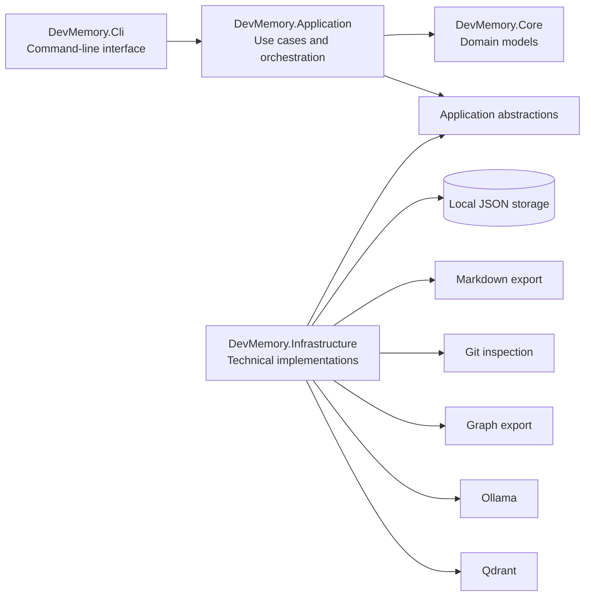
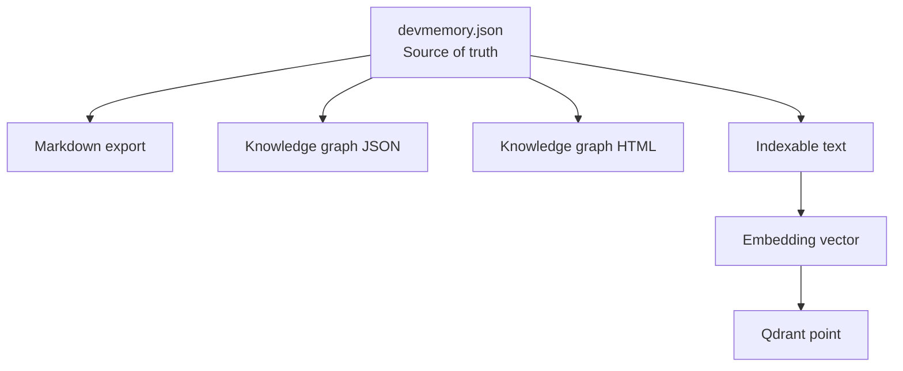
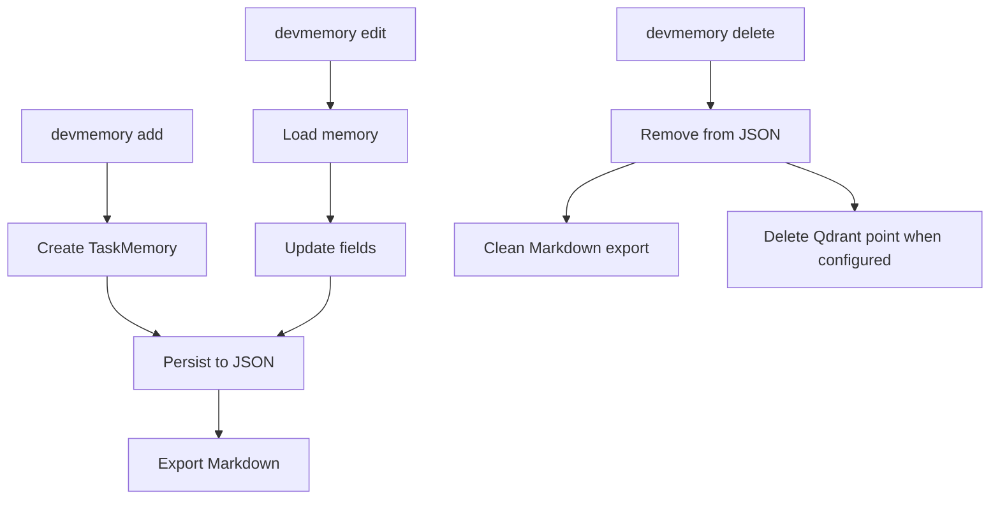
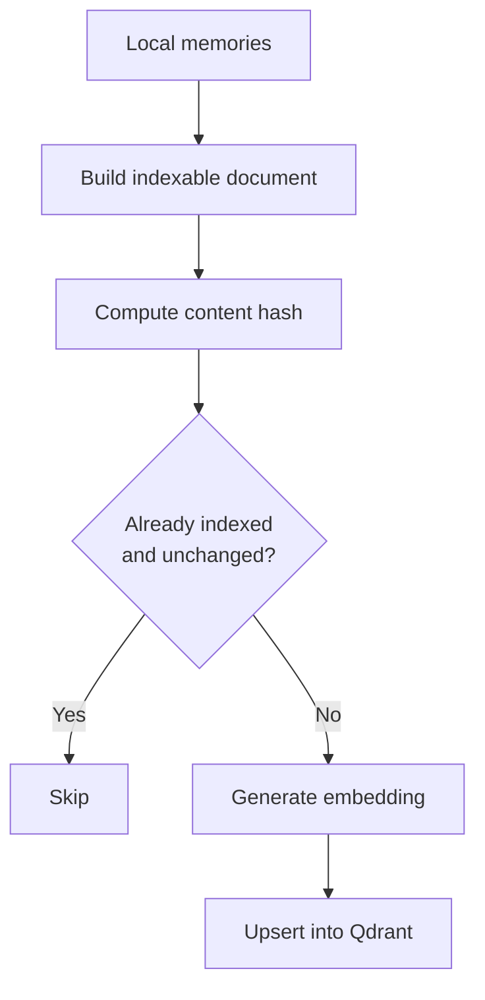
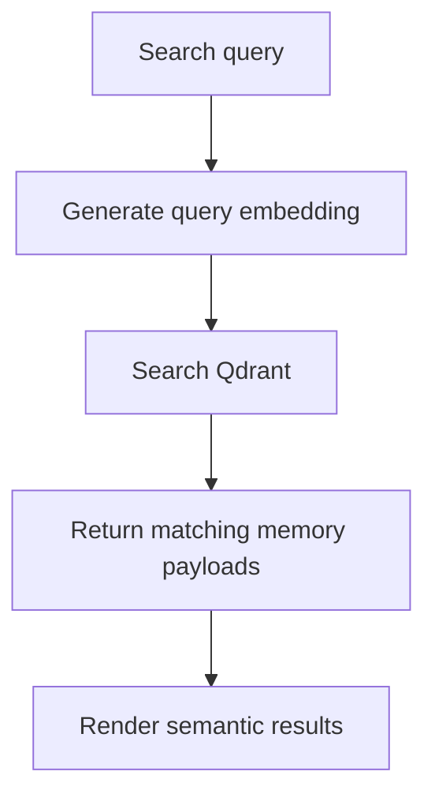
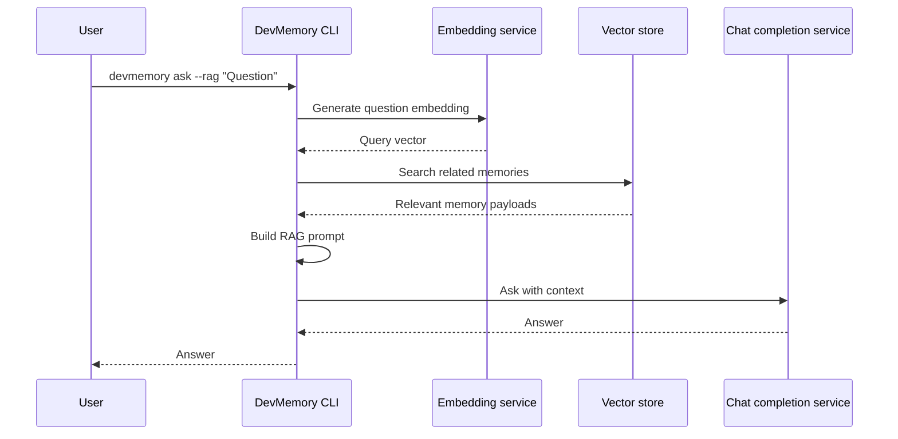

# DevMemory architecture

This document describes the current architecture of DevMemory.

DevMemory is a local-first .NET CLI designed to capture, search, export, visualize and query developer memories.

The project follows a layered architecture with a thin CLI composition layer and clear separation between domain, application logic and infrastructure concerns.

---

## Architecture goals

DevMemory is designed around a few core architectural goals:

- keep the primary memory data local;
- keep JSON storage as the current source of truth;
- treat Markdown, graph files and vector points as derived artifacts;
- keep AI/RAG optional;
- avoid cloud dependencies for core memory features;
- keep the CLI thin and focused on input/output;
- keep application orchestration independent from technical implementations;
- keep infrastructure details replaceable over time;
- make the project testable at application, infrastructure and CLI level.

---

## Solution structure

```text
DevMemory.slnx
├── src
│   ├── DevMemory.Core
│   ├── DevMemory.Application
│   ├── DevMemory.Infrastructure
│   └── DevMemory.Cli
├── tests
│   ├── DevMemory.Application.Tests
│   ├── DevMemory.Infrastructure.Tests
│   └── DevMemory.Cli.Tests
├── docs
├── scripts
└── docker-compose.ai.yml
```

---

## Layer overview



Dependency direction is intentional:

```text
CLI -> Application -> Core
Infrastructure -> Application abstractions
```

The application layer defines the contracts it needs.

The infrastructure layer implements those contracts.

The CLI composes everything together.

---

## DevMemory.Core

`DevMemory.Core` contains the core domain model.

Current main model:

```text
TaskMemory
```

This layer should remain simple and independent.

It should not depend on:

- file system APIs;
- Git command execution;
- CLI parsing;
- JSON persistence implementation details;
- Ollama;
- Qdrant;
- environment variables;
- console input/output.

The goal of this layer is to represent the domain concepts without technical coupling.

---

## DevMemory.Application

`DevMemory.Application` contains use cases, orchestration and application abstractions.

Examples of application services:

```text
MemoryService
GitMemoryDraftService
MemoryGraphService
MemoryVectorIndexingService
MemorySemanticSearchService
MemoryRagAnswerService
VectorMemoryDocumentBuilder
MemoryFileFilter
```

Examples of application abstractions:

```text
IMemoryRepository
IMemoryExporter
IGitRepositoryInspector
IMemoryGraphExporter
IMemoryGraphHtmlExporter
IEmbeddingService
IChatCompletionService
IVectorMemoryStore
```

The application layer is responsible for coordinating business behavior, for example:

- adding a memory;
- editing a memory;
- deleting a memory;
- searching memories;
- generating memory drafts from Git context;
- exporting graph data;
- building indexable documents;
- indexing memories;
- running semantic search;
- building RAG context;
- asking AI providers through abstractions.

The application layer should not know whether memories are stored in JSON, SQLite or another storage provider.

It should also not know whether embeddings come from Ollama, OpenAI or another provider.

---

## DevMemory.Infrastructure

`DevMemory.Infrastructure` contains technical implementations.

Examples:

```text
MemoryRepository
MarkdownMemoryExporter
GitRepositoryInspector
JsonMemoryGraphExporter
HtmlMemoryGraphExporter
OllamaChatCompletionService
OllamaEmbeddingService
QdrantVectorMemoryStore
AiRuntimeOptionsProvider
AiRuntimeConfigurationStore
```

This layer handles:

- JSON file persistence;
- Markdown export;
- Git command execution;
- graph JSON export;
- graph HTML export;
- Ollama integration;
- Qdrant integration;
- persistent local AI/RAG configuration;
- environment-based runtime configuration;
- derived artifact cleanup.

The infrastructure layer is where external technical details belong.

---

## DevMemory.Cli

`DevMemory.Cli` contains the command-line interface and composition root.

Main responsibilities:

- parse command-line arguments;
- call the appropriate command handler;
- compose application services and infrastructure implementations;
- print results to the terminal;
- return meaningful exit codes.

The CLI should stay thin.

Command handlers should delegate meaningful work to application services instead of containing business logic directly.

Main command areas:

```text
memory lifecycle
search
timeline
Git integration
Markdown export
knowledge graph
diagnostics
setup guidance
AI/RAG
configuration
version/help
```

---

## Local-first data model

DevMemory is local-first.

The primary source of truth is the local JSON storage file.

Default storage path:

```text
~/.devmemory/devmemory.json
```

If `DEVMEMORY_HOME` is set, DevMemory uses that directory instead.

```text
DEVMEMORY_HOME=~/devmemory-work
```

The storage model is intentionally simple at this stage:

```text
TaskMemory[]
```

JSON is currently preferred because it is:

- easy to inspect;
- easy to back up;
- easy to restore;
- portable;
- simple for an early local-first CLI.

SQLite may be introduced later as an optional storage provider.

---

## Source of truth and derived artifacts

DevMemory separates primary data from derived artifacts.



Primary data:

```text
~/.devmemory/devmemory.json
```

Derived artifacts:

```text
~/.devmemory/markdown/
~/.devmemory/graph/
Qdrant vector points
```

If derived artifacts are deleted, they can be regenerated from JSON storage.

If Qdrant data is lost, memories are not lost.

The vector index can be rebuilt.

---

## Memory lifecycle

The memory lifecycle is centered on local storage.



Supported lifecycle commands:

```text
devmemory add
devmemory list
devmemory show <memory-id>
devmemory search <query>
devmemory edit <memory-id> [options]
devmemory delete <memory-id> [--yes]
devmemory timeline
```

---

## Git integration

Git integration is implemented as an infrastructure concern behind an application abstraction.

The CLI command:

```bash
devmemory git-status
```

uses the Git repository inspector to collect:

```text
repository path
current branch
last commit hash
last commit message
changed files
```

The command:

```bash
devmemory learn-from-git
```

uses Git context to create a memory draft.

Generated files are filtered to avoid polluting memories with build output, local artifacts or generated files.

---

## Markdown export

Each saved memory is exported to Markdown.

Default directory:

```text
~/.devmemory/markdown/
```

Markdown export is a derived artifact.

It exists to make memories easy to reuse in:

- documentation;
- AI assistant prompts;
- code review notes;
- project notes;
- external tools.

Markdown export should not become the primary source of truth.

---

## Knowledge graph

DevMemory can export memories as a local graph.

Commands:

```bash
devmemory graph-export
devmemory graph-view
```

The graph currently represents relationships between:

```text
Memory
Project
Area
Tag
File
```

The graph JSON and HTML files are derived artifacts generated from local memory storage.

---

## AI/RAG architecture

AI/RAG is optional.

Core memory commands do not require AI providers, Ollama or Qdrant.

The AI/RAG flow uses three main abstractions:

```text
IEmbeddingService
IVectorMemoryStore
IChatCompletionService
```

Current local implementations:

```text
OllamaEmbeddingService
OllamaChatCompletionService
QdrantVectorMemoryStore
```

---

## Vector indexing flow



Indexing command:

```bash
devmemory index
```

Dry-run command:

```bash
devmemory index --dry-run
```

The index can be rebuilt because the source of truth remains the local JSON storage.

---

## Semantic search flow



Command:

```bash
devmemory semantic-search "your topic"
```

Semantic search requires:

- configured embedding provider;
- configured vector store;
- indexed memories.

---

## RAG flow



Command:

```bash
devmemory ask --rag "your question"
```

RAG requires:

- chat provider;
- embedding provider;
- vector store;
- indexed memories.

---

## Configuration model

DevMemory supports runtime configuration through environment variables and persistent local configuration.

Configuration precedence:

```text
Environment variables > ~/.devmemory/config.json > default values
```

This allows two usage styles:

- temporary overrides through environment variables;
- persistent local defaults through `devmemory config set`.

Examples:

```bash
devmemory config set chat-provider ollama
devmemory config set embedding-provider ollama
devmemory config set vector-store qdrant
```

---

## Diagnostics

Diagnostics are split into two levels.

General diagnostics:

```bash
devmemory doctor
```

Checks:

```text
storage readability
Markdown directory
persistent configuration
AI/RAG runtime configuration
Git availability
memory count
```

AI runtime diagnostics:

```bash
devmemory ai-doctor
```

Checks:

```text
chat provider
embedding provider
vector store
Ollama/Qdrant readiness when configured
```

---

## Testing strategy

The project has tests at multiple levels:

```text
DevMemory.Application.Tests
DevMemory.Infrastructure.Tests
DevMemory.Cli.Tests
```

The test suite covers:

- memory service behavior;
- validation and normalization;
- ranked search;
- editing;
- deletion;
- Markdown cleanup;
- JSON storage;
- Markdown export;
- Git memory draft creation;
- generated file filtering;
- graph export;
- vector indexing;
- semantic search;
- related memories;
- RAG orchestration;
- persistent AI configuration;
- doctor diagnostics;
- setup command behavior;
- CLI command parsing;
- package smoke behavior.

---

## Release engineering

The release pipeline is shared between local development and GitHub Actions.

Main validation command:

```bash
./scripts/release-check.sh
```

The release check validates:

```text
build and tests
repository hygiene
repository support files
documentation links
changelog entry
version consistency
package artifact structure
CLI package smoke test
final package checksum
```

This makes local validation and CI validation consistent.

---

## Current architectural limitations

Current limitations are intentional and acceptable for the current stage:

- primary storage is JSON-based;
- CLI parsing is manual;
- SQLite storage is not available yet;
- hosted/cloud sync is not available;
- graph visualization is simple and static;
- setup guidance is not fully interactive yet;
- local AI/RAG requires external local services such as Ollama and Qdrant.

These are candidates for future evolution, not blockers for the current architecture.

---

## Future architectural directions

Possible future improvements:

- optional SQLite storage provider;
- interactive setup wizard;
- richer CLI rendering;
- stronger command-line parsing with `System.CommandLine` or `Spectre.Console`;
- improved graph layout and filtering;
- local web UI or TUI;
- VS Code extension;
- MCP integration;
- optional cloud LLM provider hardening;
- release automation.

---

## Design principle

The most important architectural principle is:

> Local JSON memory is the source of truth. Everything else is derived, replaceable or optional.

This keeps DevMemory safe, inspectable and portable while still allowing richer features such as Markdown export, graph views, semantic search and RAG.